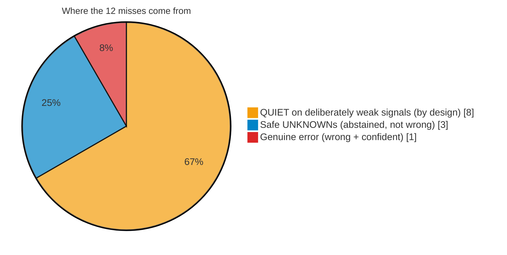
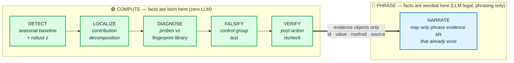
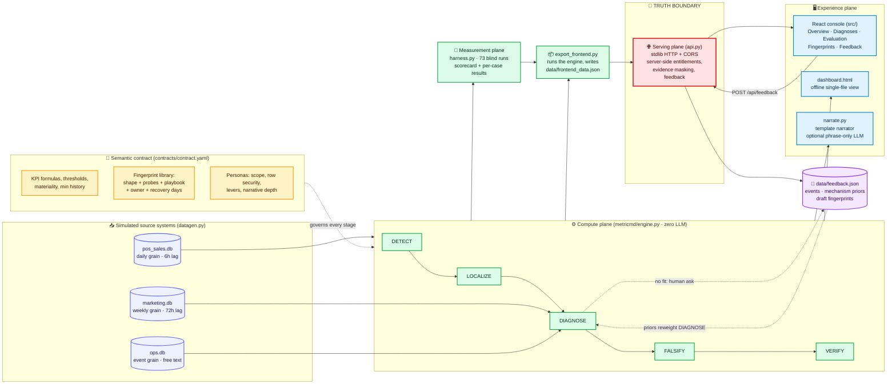
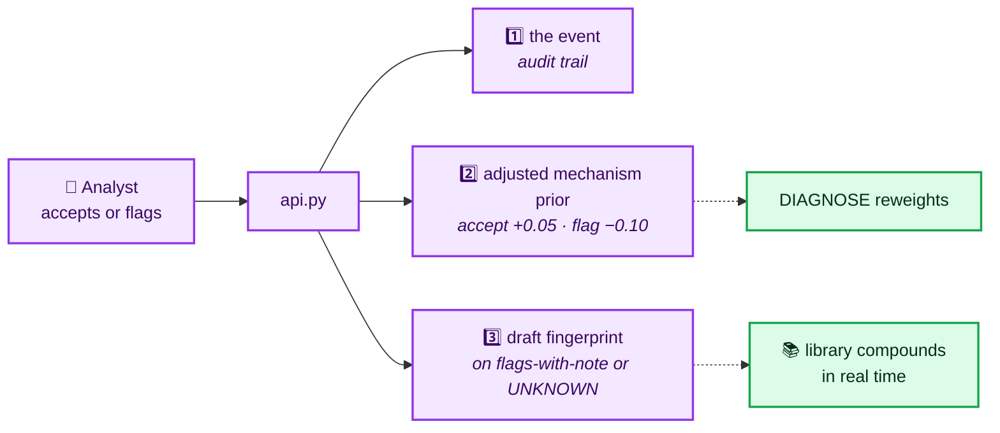

<div align="center">

# 🩺 MetricMD

### The diagnosis layer for business metrics.

**Dashboards report _what_ changed. MetricMD tells you _why_ — then tests its own answer against a control group, refuses to guess when the evidence is thin, and comes back later to check whether its prescription actually worked.**

<br/>

[](https://metricmd.lovable.app)
[](#-the-one-number-that-matters)
[](#-the-one-number-that-matters)
[](#-the-truth-boundary)

[](#-quick-start)
[-f59e0b)](#-quick-start)
[](#-quick-start)
[](#-quick-start)
[](#-quick-start)

<br/>

**Team Phoenix · IIT Kanpur**
Accenture Innovation Challenge 2026 · Round 2 · Track 3 (BusinessIntelligence.ai)

Built by **Kalpak Agrawal** · **Sanket Bansal** · **Karmanya Goyal**

<br/>

[Why it exists](#-why-it-exists) ·
[The number](#-the-one-number-that-matters) ·
[Truth boundary](#-the-truth-boundary) ·
[Architecture](#-architecture) ·
[Four stories](#-the-four-story-demo) ·
[Quick start](#-quick-start) ·
[Rubric](#-rubric-coverage) ·
[Honest limits](#-what-we-get-wrong-on-purpose)

</div>

---

## 🎯 Why it exists

Every BI tool on the market is very good at drawing a line that goes down. Not one of them will tell you **why** it went down, and none of them will admit when they don't know.

MetricMD is built around one idea: **the truth boundary.**

> Everything left of the boundary **computes** facts.
> Everything right of it **phrases and displays** facts.
> A number may cross from left to right. A number may **never be born on the right.**

<table>
<tr>
<th width="50%">🟥 What a dashboard gives you</th>
<th width="50%">🟩 What MetricMD gives you</th>
</tr>
<tr>
<td valign="top">

"North / Dairy revenue is **down 9%**."

<br/>

- A chart
- A red arrow
- A meeting where five people guess

</td>
<td valign="top">

"North / Dairy revenue is down 9%. Avg delivery time moved **11 → 18 min** `[E3: POS]`; ops tickets cite rider delays `[E5: keyword retrieval]`. Diagnosis: **`delivery_degradation`, 0.72 confidence**. Control test: other regions quiet, so it's local `[E7]`. Playbook: reroute rider pool. **Rechecked 10 days later → RESOLVED.**"

<br/>

- Every sentence carries an evidence id
- Every evidence id carries a method + source system
- The engine **audits its own advice**

</td>
</tr>
</table>

<details>
<summary><b>🔍 The four things nobody else does (click to expand)</b></summary>

<br/>

| | Capability | Why it matters |
|:--:|---|---|
| 1️⃣ | **Falsification** | The diagnosis is run as a *control-group test*. If a cause is claimed to be local, untouched regions must be quiet. If they aren't, the hypothesis is **demoted**, and the evidence says so out loud. |
| 2️⃣ | **Abstention** | Below the confidence floor the engine returns **`UNKNOWN`** and routes a question to the nearest human. It is scored on this: **83.3% correct honest UNKNOWNs.** Refusing to guess is a feature, not a bug. |
| 3️⃣ | **Verification** | After the playbook's recovery horizon, detection re-runs and records **RESOLVED / NOT RESOLVED** *against the engine's own earlier diagnosis*. No rival engine grades its own homework. |
| 4️⃣ | **Compounding** | An analyst flag or an `UNKNOWN` becomes a **draft fingerprint**, and mechanism priors reweight in real time (accept `+0.05`, flag `−0.10`). The library gets smarter with use. |

</details>

---

## 📊 The one number that matters

We don't ask you to trust the engine. **We measured it.** `harness.py` plants **73 labeled runs** — 8 mechanisms × 3 random seeds, weak-signal variants, a two-cause world, an unseen shock, a sparse-history world, and 12 clean series — then scores the **frozen** engine blind.

<div align="center">

| Metric | Result | What it means |
|---|:---:|---|
| **Detection recall** on planted movements | **88.5%** <br/>`54/61` | material movements caught |
| **Diagnosis accuracy**, top-1 named cause | **80.0%** <br/>`44/55` | the fingerprint named *is* the planted one |
| **False alarm rate** on clean series | **0.0%** <br/>`0/12` | tuned so a quiet dashboard stays quiet |
| **Correct honest UNKNOWN** rate | **83.3%** <br/>`5/6` | novel causes get UNKNOWN, not a guess |
| **Wrong but confident** answers | **1.4%** <br/>`1/73` | ⚠️ the failure mode that destroys trust |

</div>

> [!IMPORTANT]
> **Thresholds were frozen before the final run.** No tuning against the test set. `python harness.py` reproduces this exact table, and the Evaluation page in the console renders all 73 rows — including the failures.

<details>
<summary><b>📉 Every miss has a name (click to expand the 12 failures)</b></summary>

<br/>



| Count | Failure | Verdict |
|:---:|---|---|
| **8** | Engine stayed `QUIET` on signals deliberately planted below contract materiality | 💰 **The price we pay for a 0% false-alarm rate.** A defensible trade, and a contract knob, not a bug. |
| **3** | Engine returned `UNKNOWN` | ✅ **Safe.** It declined rather than fabricated. |
| **1** | Confidently wrong | ❌ **A genuine error.** We display it rather than hide it — it is exactly the case the Flag pathway exists to demote. |

</details>

---

## 🚧 The truth boundary

> *"The LLM should not be treated as the source of quantitative truth."* — the brief

In MetricMD that is **architecture, not a slogan.** Six stages. The LLM is legal in exactly **one** of them, and only to choose words.



| Stage | Method | LLM allowed? |
|---|---|:---:|
| **DETECT** | day-of-week seasonal baseline + robust z on residuals *(statistics)* | ❌ No |
| **LOCALIZE** | contribution decomposition across contract dimensions *(SQL + algebra)* | ❌ No |
| **DIAGNOSE** | feature probes matched against a fingerprint library *(business rules)* | ❌ No |
| **FALSIFY** | control-group test across untouched regions *(statistics)* | ❌ No |
| **VERIFY** | post-action recheck against the expected band *(statistics)* | ❌ No |
| **NARRATE** | phrase the evidence list, cite every sentence | ⚠️ **Yes — phrasing only** |

Every fact leaves the compute plane as an **evidence object**: `id`, `value`, `method`, `source system`. The narrator may only phrase facts already in that list.

> By default the prototype ships a **deterministic template narrator** — zero keys, zero cost. Set `METRICMD_LLM=1` to route the same evidence JSON through a model under the phrase-only instruction. **Either way, every number exists before the narrator is loaded** — which the telemetry chip proves on every page: `0 tokens · INR 0.00`.

---

## 🏗 Architecture

The whole system, one diagram. *(Full write-up: [`docs/ARCHITECTURE.md`](docs/ARCHITECTURE.md))*



<details>
<summary><b>⚙️ Compute plane — where facts are born (click to expand)</b></summary>

<br/>

`metricmd/engine.py` is **pure Python standard library and contains no model call of any kind.** Five stages run per KPI question.

| Stage | What it actually does |
|---|---|
| **DETECT** | Builds a day-of-week seasonal baseline and flags only movements whose **robust z** *and* **materiality** both clear contract thresholds. A second trigger catches **campaign decay** — a normal window that follows a lifted one. |
| **LOCALIZE** | Decomposes the movement across contract dimensions and emits **share statements** as evidence. |
| **DIAGNOSE** | Classifies trajectory shape with an **onset-aware classifier** that ignores isolated noisy days, runs cheap probes across all three sources (unit price movement, delivery minutes, keyword retrieval over ticket text, campaign windows, sibling categories, geographic boundedness), and scores the fingerprint library with **hard caps**. |
| **FALSIFY** | A control-group test: if the cause is local, untouched regions **must** be quiet. When they aren't, the hypothesis is demoted and the evidence says so. |
| **VERIFY** | Re-runs detection after the playbook's recovery horizon and records **RESOLVED / NOT RESOLVED** against the engine's own earlier diagnosis. |

**The hard caps that stop confident nonsense:**

```
mismatched trajectory shape  →  score capped at 0.45
zero corroborating probes    →  score capped at 0.25
direct contradiction         →  capped explicitly
```

> A competitor does not raise *our* prices, and does not generate *our* ops tickets. Contradictions are structural, not statistical.

</details>

<details>
<summary><b>🌐 Serving plane — the boundary is enforced on the server (click to expand)</b></summary>

<br/>

`export_frontend.py` executes the engine and **freezes its complete output** into `data/frontend_data.json`. `api.py` — standard library only — serves that state over HTTP with CORS.

**Entitlements are enforced here, on the server, never in the UI:**

- A persona scoped to **North** never receives the other regions **at all**.
- Withheld cases arrive as **blocked notices**, so the UI can render an entitlement wall without ever having held the data.
- **Executive** personas additionally get analyst-internal evidence **masked** and candidates **truncated to the winner**.

**`POST /api/feedback` persists three things:**



The same file runs identically on a laptop and on Render, reading its port from the environment.

</details>

<details>
<summary><b>🖥 Experience plane — five routes, zero authority (click to expand)</b></summary>

<br/>

The React console (built with Lovable, source in `src/`) renders five routes:

| Route | Contents |
|---|---|
| **Overview** | scorecard tiles · diagnosis cards · activity feed · region × category heat strip |
| **Diagnoses** | filterable table + board, full detail drawer with candidates and the control test |
| **Evaluation** | per-mechanism accuracy bars + the complete **73-row** harness table with failure filters |
| **Fingerprint Library** | the 8 cause cards + the drafting slot |
| **Feedback** | event timeline · mechanism priors · draft fingerprint queue |

A **persona switcher** pins **Priya** (executive, North-scoped) or **Dev** (analyst, full depth) and refetches entitled state on every switch.

> The app carries a **bundled snapshot** of engine output and falls back to it silently whenever the API is unreachable — so the published URL **can never render a broken page.**

`dashboard.html` is an older, dependency-free single-file rendering of the same run, kept because it works with **no server at all.**

</details>

---

## 🎬 The four-story demo

`python demo.py` builds one simulated quarter with four planted realities and walks them end to end.

<details open>
<summary><b>1️⃣ The dip with a cause in no table</b> — <code>North / Dairy</code> · revenue −9%</summary>

<br/>

> **No sales column explains it.**

The engine pulls **avg delivery time from POS** (11 → 18 min), retrieves **ticket text citing rider delays** from the ops system, diagnoses **`delivery_degradation` at 0.72**, prescribes the contract playbook — then rechecks **10 days later** and reports **`RESOLVED`, diagnosis confirmed.**

🏆 *No rival engine audits its own advice.*

</details>

<details>
<summary><b>2️⃣ The slow bleed</b> — <code>West / Beverages</code> · −2% a week, never a single-day alarm</summary>

<br/>

No single day ever trips a threshold. **Trajectory classification** catches the slide anyway; the **control test proves it is local to West**; diagnosis **`competitor_entry` at 0.80.**

🏆 *The movement a threshold-based alerting tool structurally cannot see.*

</details>

<details>
<summary><b>3️⃣ The win, explained</b> — <code>East / Household</code> · +7% lift</summary>

<br/>

A lift gets the **same** treatment as a drop: **`discount_launch`**, price evidence cited, promo-ROI action attached.

🏆 *Wins deserve explanations too. "Why did it go up?" is an unanswered question in every BI tool on the market.*

</details>

<details>
<summary><b>4️⃣ The honest unknown</b> — <code>South / Household</code> · a shock no fingerprint fits</summary>

<br/>

Best score **0.45 — below the confidence floor.** The engine says **`UNKNOWN`**, routes a question to the nearest human, and **the answer becomes a new fingerprint.**

🏆 *Refusing to guess is a feature. The library compounds from its own ignorance.*

</details>

<br/>

**Plus, in the same run:** an entitlement block (Priya, contract-scoped to North, asks about West and is **refused with an audit log**), executive vs analyst narrative depth, and runtime telemetry (**83 ms** full pipeline, token and INR cost meters).

---

## ⚡ Quick start

**3 commands. 1 dependency. 0 API keys.**

```bash
pip install pyyaml

python harness.py          # regenerate data + run all 73 scored scenarios
python demo.py             # the four-story walkthrough above
python dashboard.py        # renders the same run as dashboard.html
```

Then, for the API + console:

```bash
python export_frontend.py && python api.py    # JSON API over the frozen engine output
```

> Pure Python standard library everywhere **except YAML parsing.** No API keys required. `dashboard.html` needs no server at all.

<details>
<summary><b>🚀 Three ways to run, in increasing reach (click to expand)</b></summary>

<br/>

| | Mode | How | Notes |
|:--:|---|---|---|
| 💻 | **Local** | `pip install pyyaml` → `harness.py` → `export_frontend.py` → `api.py` | Console at the published URL, or `dashboard.html` fully offline. |
| ☁️ | **Cloud** | Same `api.py` on **Render** (free tier), start command `python api.py` | The committed `frontend_data.json` lets it boot with **zero build steps.** |
| 🌍 | **Public** | [metricmd.lovable.app](https://metricmd.lovable.app) → Render API, bundled snapshot as fallback | Judges get a **working product with zero setup**, and a fully live one when the API is awake. |

> ⚠️ Feedback written on Render lives on **ephemeral disk** — intentional for demos. Every restart is a clean slate.
> ⚠️ The Render free tier sleeps after **15 idle minutes** and wakes in ~**50 seconds**, during which the console serves its snapshot invisibly.

</details>

<details>
<summary><b>🎛 Turning the LLM on (click to expand)</b></summary>

<br/>

```bash
export METRICMD_LLM=1     # routes the same evidence JSON through a model
python demo.py            # ...under the phrase-only instruction
```

`narrate.py` is **the only file where an LLM may legally execute.** The entire product functions with it disabled — which is the point. Watch the telemetry chip: with the LLM off it reads `0 tokens · INR 0.00`, and **every number on the page is still there.**

</details>

---

## ✅ Rubric coverage

<div align="center">

| Round 2 minimum expectation | Where it lives |
|---|---|
| ☑️ 3–5 connected KPIs, 2–3 sources, different grains and cadences | `contracts/contract.yaml` — `net_revenue`, `units_sold`, `avg_delivery_min` over **daily** POS, **weekly** marketing, **event-grain** tickets |
| ☑️ Lightweight semantic contract (definitions, drivers, thresholds, lineage, access) | `contracts/contract.yaml` — **the engine knows nothing outside it** |
| ☑️ Two personas with different narratives and actions | `regional_head` (executive, lever-scoped) vs `central_analyst` (full depth) |
| ☑️ One multi-factor movement with known drivers | harness **double-cause world** (delivery degradation + price rise together) |
| ☑️ One low-confidence abstention scenario | **Story D** + 6 `UNKNOWN` harness runs |
| ☑️ One sparse-history scenario | `harness sparse-1`: 40 days of history, contract floor is 42 → **engine abstains by rule** |
| ☑️ One role-based security scenario | entitlement block in `demo.py`, **enforced from the contract**, re-enforced server-side in `api.py` |
| ☑️ Evidence with freshness, method, contribution, confidence, lineage | every evidence id carries **method + source**; confidence is a scored blend |
| ☑️ Clear LLM vs non-LLM breakdown | [the table above](#-the-truth-boundary), enforced in `narrate.py` |
| ☑️ Runtime telemetry: latency, model calls, tokens, cost | `Telemetry` class, printed in **every** demo run |

</div>

---

## 📁 Repository layout

```
metricmd/
│
├── contracts/
│   └── contract.yaml            📜 semantic contract — the single source of truth
│
├── metricmd/
│   ├── datagen.py               🏭 three mismatched source systems
│   ├── engine.py                ⚙️ the deterministic core, five compute stages
│   └── narrate.py               ✍️ the only file where an LLM may execute
│
├── harness.py                   🧪 73-scenario blind evaluation + scorecard
├── demo.py                      🎬 the four-story walkthrough
├── dashboard.py                 📊 renders the engine's output as dashboard.html
├── export_frontend.py           📦 runs the engine, exports data/frontend_data.json
├── api.py                       🌐 zero-dependency JSON API — server-side entitlements,
│                                   evidence masking, feedback → priors + draft fingerprints
│
├── src/                         🖥 React console (Lovable)
│
├── data/
│   ├── frontend_data.json       ❄️ frozen engine output
│   └── feedback.json            💬 events, mechanism priors, draft fingerprints
│
├── docs/
│   ├── ARCHITECTURE.md          🏗 system diagram and design decisions
│   ├── BUSINESS_PROPOSAL.md     💼 problem, market, pricing, roadmap
│   └── LOVABLE_PROMPT.md        🎨 the full prompt used to build the console
│
└── ASSUMPTIONS.md               🤝 every assumption, stated as an assumption
```

---

## 🔬 What is honestly simulated vs real

<table>
<tr>
<th width="50%">✅ Real and running</th>
<th width="50%">🧪 Simulated</th>
</tr>
<tr>
<td valign="top">

- Multi-source SQL reconciliation
- Seasonal detection
- Contribution analysis
- Fingerprint diagnosis
- Control-group falsification
- Post-action verification
- Abstention
- RBAC + server-side entitlements
- Feedback capture and prior reweighting
- Telemetry
- **The 73-case blind measurement of all of it**

</td>
<td valign="top">

- **The business data itself** — three generated source systems, *as the brief instructs*
- **The LLM call**, which is an optional hook so the repo runs with zero keys

<br/>

The fingerprint library ships with **8 mechanisms**; the production vision is roughly **30**, grown by the `UNKNOWN → fingerprint` loop.

</td>
</tr>
</table>

---

## ⚠️ What we get wrong, on purpose

Stated plainly, because a system that hides its failure modes has already lied to you once.

| Failure mode | Why we chose it |
|---|---|
| **Weak signals below contract materiality stay `QUIET`** | The cost of the **0% false-alarm rate**. 8 of the 12 harness misses are exactly this — and materiality is a **contract knob**, not a code change. |
| **Late onsets are labeled "persistent until proven"** | We would rather be *provisional* than *guess*. |
| **1 confidently wrong run in 73** | This is precisely the case the **Flag pathway** exists to demote. We ship it visible. |
| **Render free tier sleeps (15 min idle, ~50s wake)** | The console serves its bundled snapshot invisibly. The page never breaks. |
| **The simulation-to-production gap** | Acknowledged, not hidden. **Every threshold lives in the contract** precisely so a first design partner can retune on live data **without touching code.** |

---

<div align="center">

### 🩺 A dashboard tells you your metric has a fever.
### MetricMD tells you it's the delivery times, proves it isn't the competitor, and comes back Thursday to check your temperature.

<br/>

**[▶ Try the live console](https://metricmd.lovable.app)** · **[🏗 Read the architecture](docs/ARCHITECTURE.md)** · **[💼 Read the business case](docs/BUSINESS_PROPOSAL.md)**

<br/>

Built with far too much care by **Team Phoenix**, IIT Kanpur
Kalpak Agrawal · Sanket Bansal · Karmanya Goyal

*Accenture Innovation Challenge 2026 · Round 2 · Track 3*

</div>
