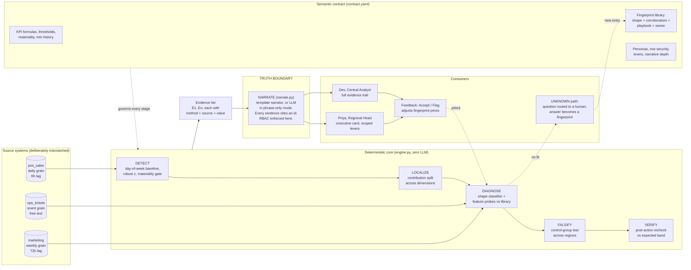

# MetricMD Architecture

The system is organised around one line: **the truth boundary**. Everything to the left of it computes facts. Everything to the right of it phrases facts. Numbers may only cross the boundary from left to right, never appear on the right side first.

## Why each stage exists

**DETECT.** A day-of-week mean baseline with a robust z on residuals, gated by a materiality floor from the contract. Statistics, because anomaly detection is a solved statistical problem and an LLM adds nothing but cost and risk here. A second trigger catches campaign decay: a window that looks normal but follows a lifted window is itself a movement worth explaining.

**LOCALIZE.** Contribution decomposition over the contract's dimensions, skipping any dimension already pinned by the question. SQL and algebra. The output is a share statement such as "channel=App explains 51.8% of the movement", which becomes evidence, not prose.

**DIAGNOSE.** The distinctive piece. The engine computes a trajectory shape (cliff and rebound, slow slide, persistent step, spike and return, lift) using an onset-aware classifier that ignores isolated noisy days, then runs cheap deterministic probes across all three sources: unit price movement, delivery minutes, keyword retrieval over ticket text, campaign windows from the weekly source, sibling category movement, geographic boundedness. Shapes and probes are matched against the fingerprint library with capped scoring: a fingerprint whose shape does not match is capped at 0.45, one with zero corroborators at 0.25, and contradictions (a competitor does not raise our prices or our ops tickets) are capped explicitly. Retrieval over unstructured text is retrieval, not generation: ticket counts are computed, then cited.

**FALSIFY.** Popper for dashboards. If the diagnosed cause is local, untouched regions must be quiet. The engine checks them; if two or more control regions moved the same way, the local hypothesis is demoted and the evidence says so. An explanation that survives an attempt to kill it is worth more than one that was never tested.

**VERIFY.** The stage nobody ships. Every playbook in the contract carries an expected recovery horizon. After it passes, the engine reruns detection and reports RESOLVED or NOT RESOLVED against its own earlier diagnosis. The action chain in the brief ends with "monitoring plan"; this is the monitoring plan, executing.

**NARRATE.** The only file where an LLM may legally appear. Default is a deterministic template (zero keys, zero tokens, zero cost). With `METRICMD_LLM=1` the identical evidence JSON goes to a model under a phrase-only instruction. Row security is enforced here from the contract before a single word is produced, and blocked requests are written to the audit note.

## Confidence, tiers, and abstention

Confidence is a scored blend: 50% fingerprint match quality, 30% statistical severity, 20% localization concentration, minus a penalty when the control test fails. Three tiers govern behaviour: CONFIDENT (score at least 0.70 with a clear margin) ships a diagnosis and a playbook; AMBIGUOUS ships the top two candidates plus the one separating test that would distinguish them; UNKNOWN (below 0.50) refuses to name a cause, routes a question to the nearest owner, and the eventual human answer is added to the fingerprint library. The library compounds: every resolved unknown makes the next diagnosis faster.

## Telemetry and cost envelope

Every stage logs milliseconds; the narrator logs tokens and INR at contract price. The demo's full four-story run completes in under 100 ms of engine time with zero LLM tokens in template mode. With an LLM narrator enabled, a diagnosis costs roughly one narrative call, in the 3 to 5 INR band at current commercial pricing, which is the unit economics the business proposal builds on.

## Failure modes, stated plainly

The harness documents them: weak signals below the materiality floor stay QUIET (by design, the cost of a zero false alarm rate), late onsets are called persistent-until-proven rather than guessed, and one run in 62 produced a wrong confident answer. The mitigation for that residual class is the feedback loop: a Flag from a user lowers the offending fingerprint's prior for that region.
